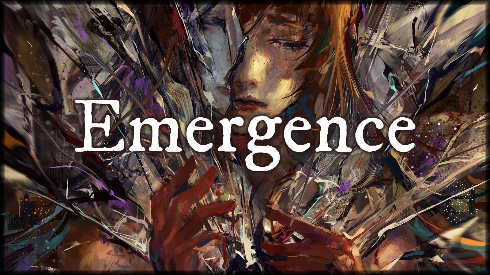
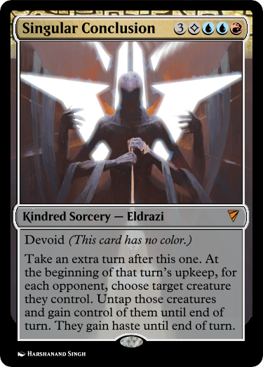
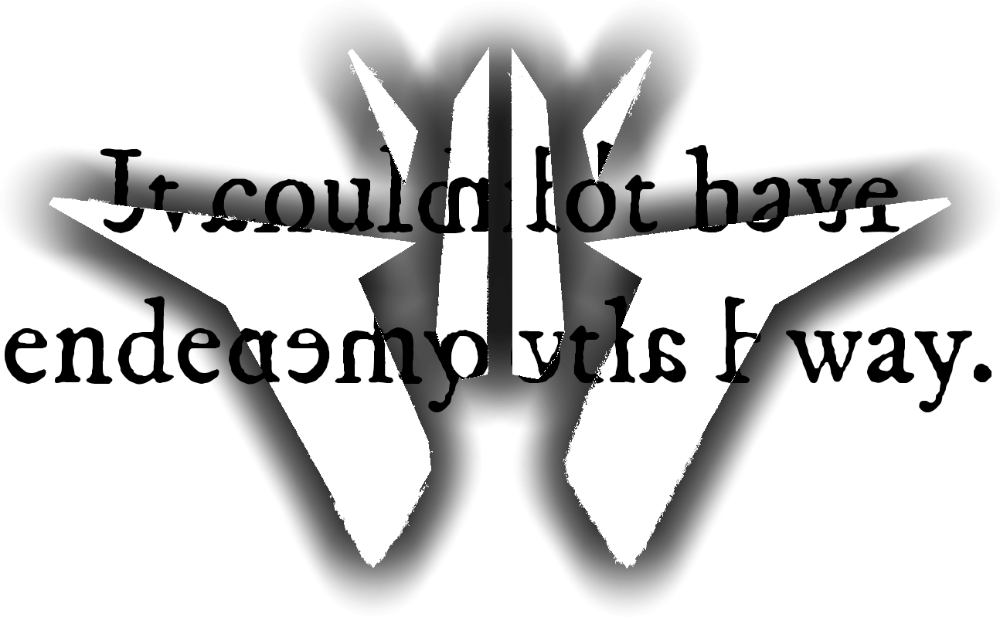
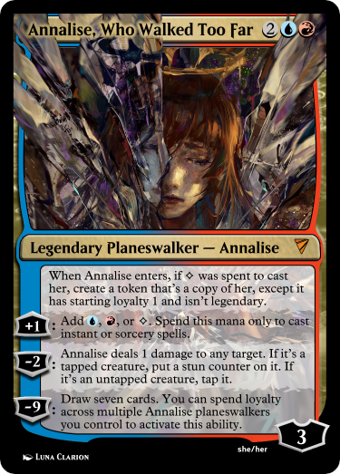

<link rel="stylesheet" href="../../resources/story.css">

<h1 class="story-header"></h1>

## An unofficial *Stirrings in Goldport* Story

#### *continued from* [*Refraction*](refraction.html)

Sleep does not come easily.

I stumble my way through a meal offered to me by the hospital staff—good fare, though my second dose of the medicine—absentia, they had called it—ruined any hope of tasting it. I hear murmurs about fire damage, though I’m assured it poses no structural risk. I’m too weary to argue.

Finally, I’m returned to my room. I can tell by the absence of a previously-omnipresent low *hum* that the lights have been put out.

I toss and turn for what feels like hours, though this place has no chronometer where I can hear it. I see the book again, same incomprehensible gibberish taunting me, laughing at me. Though I can’t read a word of it, I feel as though it’s telling me with tittering laughter that *you’ll never see again.*

I push it away with memories of Marion reading the chapter. I will get better, and even in the meantime I can study.

Finally, I drift off.

—

Apparently I can see just fine in my dreams.

I’m on the gangway again, fresh out of the ship’s hold. There are two figures arguing on the dock, though both are indistinct, their voices incomprehensible.

I’m barefoot, wearing some thin silk robe—*dress?—*that I’ve never in my life seen, a cream-colored thing embroidered with shimmering geometric patterns that look like… crowns? Horns, perhaps? A few feet ahead of me, at the foot of the wooden walkway, is a puddle still as ice.

The sky is dark, a full dome blacker than ink, without moon or stars. Nevertheless, my surroundings are lit with a flickering green-blue light that ebbs and flows, following an almost musical rhythm, though there is no sound.

I walk down, careful not to incur splinters. Carefully, I try to step over the puddle, and a hand clasps my shoulder from behind, cutting my stride short, my feet making contact with the surface of the water, scattering it into—

—*a whirl of impossibly beautiful light. I remember now.*

*I learned how to see. It just takes a while to get used to.*

*I see Goldport, in all its imperfect majesty. I’m atop the envelope of a ponderous airship, the canvas surface deforming beneath me and creating a soft cradle from which to stare down. I see the buildings, like doll’s houses, the Hall of Dominion like an intricate cog, a pivot on which history spun. I see the people, like ants and universes, who make this city their home. I look closer, and I see them split and fracture, histories spinning into futures across dimensions I will learn to name, falls into darkness and pivots from the least of the least into heroes whose names the city sings. I flit from life to life, witnessing shining moments again and again.*

*I remember it all. It had come so naturally to me. I thought motes of lead oxide into the glassy time, and watched as history bent at sharper angles, heirlooms lost for centuries rediscovered by a tripping child, an esteemed thespian choking to death on a falling rose petal.*

*I watched from the sky for hours.*

*I piece the last evening back together. Marion, reading books to his pitifully blinded friend. A part of* *me trying* *to push out of time, and mostly only succeeding at driving me mad, answering questions before they’re asked and feeling whiplash as the moments reassemble themselves.*

*To think all I needed was some sleep to set me right.*

*One question nags at me, though. Why did I forget?*

*No sooner do I form the thought than it all goes wrong.*

*I remember playing across a future of a handsome youth of sixteen, fiery-eyed and full of passion, exploring a refraction where he joins the West District Union. He’s face-to-face with a hired thug—consequence, though he knows it not, of some untoward word around a particularly unscrupulous shift manager—when his eyes go slack, the sturdy cane he favors slipping from suddenly numb hands, and something that’s been burgeoning inside takes him off like an evening gown.*

*A lance of obsidian from a direction that doesn’t exist skewers the thug in an instant. Satisfied, the thing-that-was-young turns—*

and meets my eyes directly, and I come face to face with the thing behind it.

A future occludes my view across the seven dimensions I can see and ten orders of magnitude more I cannot.

Agony.

The world dies cold. Stars wink out as tendrils from the heavens sweep cities off the map, and I feel the weight of every fractal life snuffed out in an instant, no path stretching beyond this moment. Wind tears the earth asunder, and the ebbing few who survive turn on each other for the scraps that remain, until they too are gone.

In the middle of it all, I can feel *something* inside of me screaming, a tether trying to pull me out, a nomad made of radiance shed from a brilliant sun trying to become real, *me* truer than *me* trying to take this moment of terror and *rise* from it. Its howls reach a crescendo, until finally there’s a *pull*, a twisting step through a door that was inside of me from the very start.

I’m in a prestigious lecture hall. Granted, I’d never seen a prestigious lecture hall until my dance through futures a moment ago, but I’m confident this is what one looks like, a towering space of elegant marble with seats set with velvet cushions. Empty, except for me and one other.

At the head of the room is a woman—middle-aged, dressed in a sharp black coat and wearing thick, gold-rimmed spectacles. Her greying hair is tied back and held in place by a pin that looks sharp enough to kill.

I recognize that face. A little older, but I would have to be mad not to know the appearance of Ceyla Runfel, featured as it is on the back cover of the book that shares her process’s name.

She clears her throat and begins to speak.

*Before my work, the practice of optics was governed as much by selection as by design. A lens could be calculated precisely and still fail because the glass itself would rebel against the mathematics: one batch clouded, another warped, a third bent blue light differently from red and drove automata fitted with its* *product mad**.*

*What is now flatteringly dubbed the Runfel process is not merely a way to make better glass, but a way to dispense with that uncertainty. A transformation of the optician’s art from a game of chance into a science that can define initial conditions, prepare ingredients, and upon completion, declare with authority that*

Ceyla stares directly at me and *shatters*, and I feel the light within me slamming into a wall of flesh around Calloran, a wall of chalk around Goldport, a wall of shimmering black obsidian around me, trying frantically to ignite. With each impact, the pain intensifies, the smell grows louder, brighter, sharper, and I finally have a name for it.

It’s the smell of the friction-burns as my soul dies.

I remember why I forgot.

No time at all has passed. My foot is wet. I’m back on the empty black docks. Very distantly, in the sky, I see three stars.

There’s a hand on my shoulder, the one that pulled me into the puddle. I turn around to see its bearer, and there was never a hand at all.

Wordlessly, I walk back up the gangway, onto the deck, and watch the stars get closer. I take a seat on the gunwale. The crowns embroidered on my dress are starting to glow.

I don’t think I’m making it to morning.

<table class="story-table"><tr><td>MEDICAL CERTIFICATE OF DEATH &nbsp; Name of Deceased:      Andrew Licent Age:                   Nineteen years Residence:             Room 204, 115 Vane Street Date of Death:         13th o. Jadian’s Fall, 1201 Time of Death:         5:38 AM (approx.) Place of Death:        Lionel Clanston Memorial Medical Center &nbsp; Cause of Death: You are not yours to keep.     Our promise is fulfilled.. &nbsp; Duration of final illness:  3 hours, 14 minutes (approx.) &nbsp; I hereby certify that I attended the deceased during his last illness, and that the cause of death was as stated above. &nbsp; U. E. Konstantin, T.I. 14th o. Jadian’s Fall, 1201</td></tr></table>

The stars are very bright now.

I shake a drop of water off my fingers into the silent sea, and watch the ripples in their light. No futures worth finding in that reflection.

Something other than a future, maybe. I pull a match from the gunwale beside me and strike it. I contemplate the fire for a second.

I toss the match onto the deck of the boat, which quickly spreads across a puddle of oil dripped by an inoperative winch, gnawing hungrily against the rest of the boat. The warmth is nice, and I breathe a slow sigh of relief as the tension in my back unspools.

The firelight reflects in the water too. I pull myself into the reflection, and peer around a corner of time—not to the future, where They wait, but to another present. A slightly different flavor of the end.

Marion’s hand settles in mine.

I stare into the water as the flame spreads further across the deck. “Can I get an answer for the magic, Marion?”

He squeezes my hand, and I can feel his fingers—smooth and fragile, like glass. “The pyrotechnics in the Stedwin? Just a trick. My parents are both chemists, and quite well-to-do for it. Mostly industrial stuff, but they make the occasional plaything for novelty, and I take a couple down to the Stedwin. Break the package, scatter the powder with a little sleight,” He smiles. “It adds wonderfully to the atmosphere.”

I pull something from a pocket in the air. One last little light, dancing between the fire and the stars. My spark that might have been.

“How did you do it? Just a flick of the wrist?”

“Pretty much. The hard part’s keeping it secret. No more need for that now.”

I toss it, and it diverges into a ribbon, a tide, a thousand darting threads of gold and violet, coiling over the dream sea. Each twinkle reflects in the shallow waves, and in each facet of the water I see a me that was possible.

The fire has almost engulfed me, but it’s only warm. In the distance, the threads begin to bend, gathered up into the orbit of three merciless stars to play the part of a bargaining chip.

I linger on the last reflection for a very long time.

