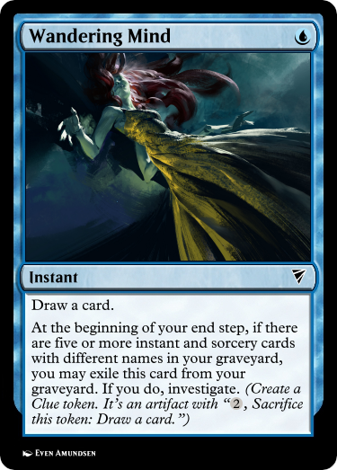
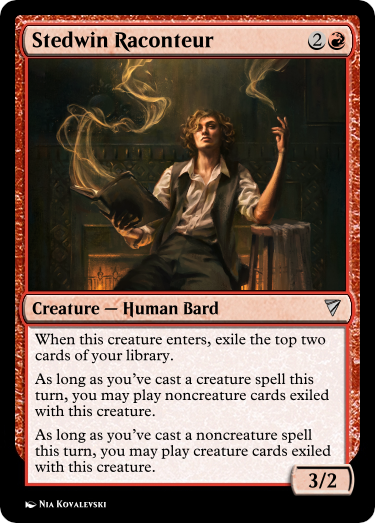

# Incidence

## An unofficial *Stirrings in Goldport* Story

#### *with gratitude to Kattalist for* [*SGP*](https://escapefromlimbo.github.io/previews/SGP) [*and*](https://docs.google.com/document/d/1IAACVGOKW2UpoqgSUMworWOBiQiyV-aje9zp76f4xEw/edit?tab=t.0) [*its*](https://docs.google.com/document/d/1S-9Ezn_ixEHyWI58hoMcfUQuYUnDlv5Vr1q6mMfElMI/edit?tab=t.0) [*canon*](https://docs.google.com/document/d/1HjnDsiMzu_BW-7Dk0GZK4MwB8_nDm6BqeVQibdbK22k/edit?tab=t.0)

        The smell burns. I would breathe through my mouth, except it’s strong enough to taste. I’d hold my breath, but it stings my eyes, which I’d shut if it didn’t scorch the eyelids just as cruelly. Absent relief, I make do by trying to ignore it, and lift the basket. It’s the last one.

        It passes through the hatch, and only the chill, faintly fishy air of the ice-hold remains. I take a moment to bask in it. There’s a smell still, but one I don’t mind. My hand grazes the railing and its rust-specked surface as I make my own way up, onto the gangway, and towards the captain, who’s currently engaged in a spirited debate with the winch operator for our catch. His gesticulating hand scatters twisted patterns through the bright early moonlight.

        “And I don’t particularly care. I come to you because you work for rates *better* than hers.” A space is beginning to open around the argument, passers-by steering clear as tempers visibly rise.

        The operator smiles with a smug helplessness stolen off a bureaucrat’s face. “I do the job in half her time with twice the skill. All that changed is my contract *recognizes* it now.”

        I don’t catch the captain’s reply. I’m looking down to keep my footing off the lip at the gangway’s edge, and my boot lands in a shallow puddle, mercifully disturbing the reflection of my face, scattering it into—

        It’s darker, suddenly. The captain has a hand on my shoulder, and the other—calloused, but gentle—is lifting my chin. I gasp, taking air into suddenly-empty lungs, and I can taste the burning again. His voice is impossibly loud, and the bright eyes in his mottled face are shot through with worry.

        “I said, are you *all right*, boy?”

        It takes me a moment to navigate sensation back to my lips. I choke out an “enough.”

        He releases me and steps back, still tense. “You were just standing there. Staring at your boots.”

        I look around. There’s no sign of the winch operator, and the streets are sparser. “Sorry.”

        His face softens. “Just because the job’s hard is no cause to be sleeping on your feet. If you need a day’s respite, I can find another—”

        “No!” It comes with more force than I intend. “It won’t happen again. I need the work.” With effort, I smile. “Thank you for the concern.”

        He raises a skeptical eyebrow, but—praise be—doesn’t press the issue. He proffers the day’s pay, muttering something about uppity winchmen before saying farewell. The burning smell from the day’s catch follows me all the way to the Stedwin.

        By the time I arrive, Marion is already halfway through a story. He’s in his chair by the hearth, one arm carelessly leaning on a barstool while the other holds a heavy tome, the warm red firelight shading to gold through the turning pages and his tousled hair. His eyes snap to me the moment I enter, and a brief smile touches his lips, though it doesn’t slow the cadence of his speech.

        “. . . seeing this, Telítan held aloft his silver staff for the third time, for in those days all wonderful things came in threes. He roared at the sky, and behind his words was a tide of warm summer air that rolled across the land like a hurricane in reverse. The dark clouds let loose their heaviest rain yet—but Telítan smiled, for he knew the tongue of the seas and skies, and knew this rain was *tears*, of penitence and of terror.”

        With an impish grin, Marion flicks his hand and a flurry of brilliant sparks twist into the air about him, bright and beautiful. They hang above, drifting in the eddies of the tavern air as Marion pitches his voice lower to deliver the challenge of the Good Wizard Telítan.

        “Run all you like, he cried, for I shall not stop until I chase you and the Whittle-Witch from the face of Calloran itself. And he stepped onto the wind he called as easily as you or I might board a carriage, and was borne away on it as it chased the storm-front, scattering in his wake diamonds and rubies which sank into the earth and grew to towering harvests of food, the finest the townsfolk had ever known. And they feasted until they had forgotten the famine, and then feasted again for the joy of it, and no dark clouds ever fell upon that land again.”

        The audience—a busy one, at this hour—is rapt as Marion speaks, sparing only the occasional glance to beckon a refill from the barmaid. A few children are among them—unusual, for an establishment like this, but a common sight at the Stedwin, for they love to listen to Marion. I meet his eyes again as his hand claps the book closed, the soft *thud* of it scattering the motes of light, which dim to stillness. He tucks it under his arm.

        I can’t say why we like his stories so. Perhaps because they’re classics—everyone hears the tales of the Good Wizard Telítan and Alice’s Green Parlor and the City in a Cauldron before they’re old enough to learn the words those tales are made of. Perhaps it’s because he never seems to run out of them—I got a look in his big book once, and I don’t think he’s actually reading from it. Perhaps it’s all the kids’ doing—an evening one can dangle as promise or punishment for an excited child, a valuable tool for a parent working long factory shifts. Perhaps it’s just the quality of the recital—I know at least three times that he’s been approached and asked to join some actors’ troupe, and he told me in private that one of the scouts had offered a position with Mertin-LaCloff, wanted him to replace the lead for *A Bottle of Time*.

        I can’t speak for anyone else. For me, it’s because he’s happy.

        I wind my way past the bustling patrons as he leans back, taking a moment’s break between tales. Outside, I hear a window shatter. The Crown and Collar’s having another of its usual nights. Dice bring in more coin than Marion, but on the other hand, we never get those sounds.

        He waves as I approach. “Andrew! Lovely to see you.”

        I slump to the ground up against the fireplace wall, breathing a sigh of relief at the warmth after a long day of cold and wet. “Couldn’t have put it better myself. How’d you pull off the trick with the sparkles?”

        He grins. “As our friend Telítan says, a wizard’s way can’t be given away.”

        I roll my eyes. “Proper archmage, you.”

        He loves his special effects. I’ve never managed to figure out how he pulls them off.

        I rest for the next few stories, letting the twin warmths of Marion’s voice and the fire take me. Somewhere in the middle of it all, I secure a sandwich and a mug. The taste washes out the last dregs of that horrible smell in the catch, though the memory of it is slower to fade. I make some progress as the firelight dims, exchanged for an ever-brightening moonlight through the Stedwin’s windows.

        Fine glass, those windows. After a few months of dithering over it, Faye Stedwin had replaced them only half a week ago. With the advent of the Runfel process, prices for glassware had plunged dramatically, and I have to admit that the light in the main room has never looked so clear as it does through Wickel and Sons’ Pristine Panes. I am embarrassed by how profoundly fascinating I find this.

        Marion finishes his last story for the evening, and the room is emptier now. He thumbs through his book, exchanging the occasional cheery glance with me, as the guests who remain turn to rumor. I roll my eyes as I hear the topic of Faye and Captain Tames broached for what must be the fiftieth time. He’d spent an off-duty evening helping install the new windows here—a favor for an establishment he frequented, as gentlemanly charity requires—and suddenly the whole place is awash with rumors of secretive liaisons between him and the owner. The fact that he’s not been seen in two days has done his otherwise-sterling reputation no favors.

        I ask Marion about the sparkles again.

        “Just magic.”

        I groan and let the subject drop.

        The clockwork chronometer on the wall sounds midnight. Closing time. The few who remain make for the door if they don’t room here, or the stairs up if they do. The former group includes Marion, the latter me.

        As he’s about to leave, I work up the nerve to catch him in a hug. He tenses with surprise at first, but in a moment he returns the gesture with the arm not holding his book. I pull back after a moment.

        He’s still smiling. “And a fond farewell to you too. What’s the occasion?”

        I look down, embarrassed. “Been out of sorts today. You helped.”

        “Well, Andr—”

        I interrupt, still not looking up. “—Ann. Um, for short. You can call me Ann.”

        “Well. Ann, it is my highest honor to have done so.” He doesn’t miss a beat.

        I don’t respond for a moment, and he steps away, but as the door swings closed behind him, I hear one more reply.

        “I’ll be in tomorrow evening!”

        There’s candlelight in my room. By it, I turn the pages of a ponderous tome of my own: *Foundations and Practicalities of the* *Runfel* *Process, as Explicated by Her Own Hand.* A dry work, to be sure—a meticulous overview of the chemical and industrial principles that made modern glassware possible. I’ve always been fascinated by it—the beauty of refraction and reflection, the fiery dance of molten material, even the slow grind of polishing that made it function.

        No positions in it for me, though. The industry was in upheaval, the bosses on the lookout for those with expertise on the latest automation, who could understand the great wheels that etched to exacting specifications the eye-lenses of golden automata. Very well. *Foundations and Practicalities* is a few years out of date, but it’s in wide print, and would make me a *fine* sight more qualified than the average neophyte.

        So I study most nights, this no exception. Ceyla Runfel is an exacting taskmaster, but her book is well laid-out, and I’m making progress. It’s my second read, slower this time, and I understand things that stumped me the first. I flick my vision between the page and the pristine window on the other side of the room, connecting at long last the theory and the practice.

        There’s a letter in the desk, a request for apprenticeship addressed to Helmi Wickel, abandoned halfway through a sentence of my best pensmanship. When I finish this reread, I think I’ll return to it.

        It’s begun to rain outside. Fingers of water tap on the glass, and pebbles and debris roll in a rising wind. I disregard it.

        A faintly heard chime calls two in the morning from the main room. I set the book down and walk up to the window, wincing at my reflection in the candlelight off it, attempting to make the page I’m on make sense. I bend down to get closer to the upper edge, trying to get a better look at how the glazing sprigs are seated.

        I can see the moon again at this angle. I blink its light out of my eyes.

        It happens rather swiftly. The wind picks up for just a moment. A roof tile, poorly maintained, slips loose from a building high above. The shattering launches a sharp ceramic shard at a particular angle, and the glass of my window takes the impact, spiderwebbing into a fractal of—

        My head hurts. My head hurts like hell. Through the muddying of everything, I perceive, very faintly, the chime for nine in the morning.

        I can’t see. I lift my hands to my face and flinch back, the faintest touch revealing that my eyelids are rubbed raw. I feel like an open wound. Out of instinct, I blink, and the pain wracks me with a sob. It’s through this I discover that my throat is impossibly dry. I can’t let out more than half a sound.

        The smell is back. Whatever we brought in with the catch, it’s everywhere in my head now. I still can’t see. I stumble, and knees locked stiff for seven hours collapse under me, sending me tumbling. The wooden bedframe scores my head a glancing blow. I barely feel it over everything else. I still can’t see.

<em>continued in</em> <a href="refraction.html"><em>Refraction</em></a>

