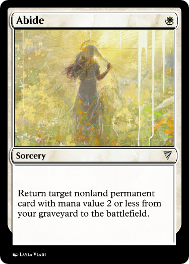
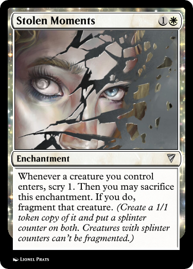
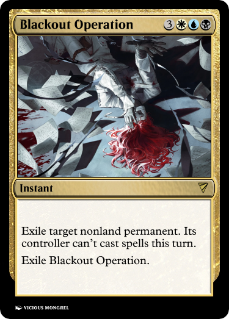

<link rel="stylesheet" href="../../resources/story.css">

# Refraction

## An unofficial *Stirrings in Goldport* Story

#### *continued from* [*Incidence*](incidence.html)

The last thing I remember clearly is crawling to the door and managing to lift my hand enough to bang on it. After that it gets muddy. Faye found me. I can recall that much. There’s a physician by the docks. A deft hand with a needle, who can usually deal with the sorts of injuries we get on the trawlers. I recognize his place by the nearness of the beating wavesound.

He’s useless. He forces a foul-tasting ichor down my throat. Faye gave me water, I preferred that. I still can’t see. After no apparent change, he gives me something else.

That one works quickly. I fall asleep on one of his beds.

I can tell I’m somewhere else when I wake. The air is colder.

On instinct, I try to blink, and the pain of my eyelids is unbelievable. I squeeze them closed, resolving not to try again. I still can’t see.

There are two voices, muffled by something. One I almost recognize, another I don’t even slightly. After a brief exchange in angry tones, they disperse, and then I hear the second again, close this time, painfully loud. I try to flinch away, but I’m impossibly weak.

It’s a woman’s voice. On the older side, if I had to guess, and measured. Kind, for lack of a better word, but noticeably professional. “How are you feeling?”

I try to form a response. “Et hrah.”

Again. “...hurts.”

There’s scratching. She’s writing something down. “Drink this.”  
        A thin metal cup is pressed into my hand. I can feel writing on it, though I can’t read by touch. With difficulty, my cramped arm lifts it to my lips. It feels like nothing going down, which is a marked improvement.

In seconds, the pain diminishes. My eyes, throat, even that awful, all-smothering smell of rotting fire is quiet. I gasp in relief, and feel a surge of happiness as that gasp provokes no further pain.

I still can’t see, but this is a marked improvement.

I miss her next question. Her voice is diminished too.  
        “...say it again?” At least it doesn’t hurt to speak.

She clears her throat. “Andrew, what happened to you? When did it start?”

Collecting my memories is a struggle. “Yesterday evening. The docks. I was unloading a trawler and this *abhorrent* smell was in the catch. Like nothing I’d ever experienced.”

More scratching.

“I got off the vessel. I looked down and… I don’t remember. I woke up a second later, but I don’t remember.” I shouldn’t be saying this. I’m not mad, I know for *certain* I’m not mad, I don’t need an asylum… but what else could it be?

“And that’s when you… hurt your eyes?” More scratching.

“No. That was later, I went… home, I was looking out the window. I looked up at the moon, and something broke the glass.”

The scratching stops. “Up at the moon?”

I reply with a weak affirmative. There is the grating sound of a chair being pushed aside over rough tile. I hear footsteps for a moment, and then I am entirely alone.

I manage after a few laborious minutes to sit up. The medicine is in full effect now. I can feel almost nothing, even from my eyelids.

I savor the requiem for a pair of heartbeats, until an odd itching from my cheeks breaks the absence of feeling. It crawls to my tongue, and even through the medicine’s fog, I taste tears.

*What if my vision never comes back?* I had spent so many nights poring over that book. Reading, rereading, quietly berating myself as I tried to decipher its riddlesome diagrams. *What use could Goldport possibly have for an optician who cannot see?* My breath quickens, and I feel the tears falling faster. I try to remember the last page I read, or the last sentence on the letter I left unfinished, but the words and illustrations flicker and swim, dancing like insects of atrament before coalescing in shapes that resemble nothing so little as human speech.

I hear footsteps again. The woman is back.

“Thank you. I apologize for the sudden disappearance—it’s hospital policy to document any patients describing phenomena of lunar origin immediately.” Her voice changes, the register shifting to one of concern. “Are you alright? I promise, you’re not in any trouble.”

I lift a sleeve to rub the tears out of mercifully unfeeling eyes. “Sorry. Hospital policy? What hospital?”

She laughs, a bubbling sound. “Why, the only hospital worth the name. You’re in the Lionel Clanston Memorial Medical Center.”

I take my time before the next question. “Why can’t I see?”

There’s the sound of rustling papers. “We’re not entirely sure. You show signs of mild exposure keratopathy, but it shouldn’t be enough to render you entirely blind from our current understanding of similar cases. Externally, you’re merely injured, not broken—whatever’s stopping your sight is something else.”

She hums before continuing. “Could be neurological, ocular nerve damage, any number of things. We’d have to open you up to find out, and that’s rather challenging while you’re still alive.” Another laugh. Perhaps I’m not cut out for physicians’ humor.   
“Unless… you can tell us any more about what happened?”

I shake my head, choking back another upwelling of tears. “Past that, I don’t remember.” The page appears in my head again, its not-script forming jagged patterns on the crisply-printed paper. “I don’t remember.” The second repetition is for me.

After a moment, the vision fades enough for me to focus. “I—I am curious, though. Why am I here, at… the clan… this hospital.”  
        More rustling papers. “You were checked in by one Marion Rull. He’s waiting in the lower annex, though it’s *Clanston Memorial* hospital policy to finish a patient screening before allowing visitors.”

*Marion*? *How did he afford a place like this?* I open my lips to voice the question, but think better of it. *I’ll just ask him*.

She continues.

“However… I think we’re about done here. We’ve a few things we can try for your vision, but our best specialist in that area is away on a prolonged house call, and as you seem to be stable I’d advise not settling for inferior treatment. He shouldn’t be more than a few days. Y—”  
        “I think I would.” The idea of returning to my room, to that window, to that book I can’t read anymore and the letter in the desk, makes me sick.

“—ou are welcome to remain here for that interim period, if you’d prefer.”

“Please do.”

“Shall I send for mister Rull, then? Very well.”

Her footsteps echo away, and I take a deep breath. *What do I even say to him*?

The first words I let out when Marion enters are an apology, a miserable *sorry* that might as well have fallen from my mouth alongside a dead fish for all the cheer in it. It doesn’t slow the approach of his gait—and it is *his,* I can tell for certain—before he takes a seat on the side of my bed. I feel the contours of the *remarkably* soft mattress shift as he settles.

“Sadly, they won’t let me set up a fire to sit by. All bulbs here, something about ‘risk to fragile records’ and ‘basic accommodations of modernity’.” He can’t hide his melancholy, even through the lighthearted words. “H—

My voice is quiet. “Well enough. I still can’t see.” *He remembered.* “Thank you.”

“—ow are you holding up, Ann?”

I bristle, embarrassed. “Just… yeah, you could say favorite. I’m studying, wanted to try for a position as an optics engineer. I don’t mind the docks, but nothing there is *for* me, not really.” I lean back. “Hopefully the specialist they have can fix whatever’s wrong with my vision. In the meantime… I think I’d like that.” I smile. “Maybe it’ll make more sense in your voice.”

He taps my hand, prompting a gasp. “They told me that much. Which is why—” There’s a sound of something weighty being set on a chair. ”—I brought these. I should be able to stay for awhile, and…” Marion’s tone goes sheepish. “...I figured I could read. Either another story, like at the inn, or… I brought this book from your room. *Foundations and Practicalities of the* *Runfel* *Process.* A favorite of yours?” I’ve missed that voice.

“Alright. Come back soon?” I sigh. “I—oh, fathoms, I never asked. How on earth could you afford to have me taken here? And why did you bother?”

“...will be made clear, so to speak, in section IV.” He closes the book and lets out a yawn. “The science, I can handle. The quips may do me in.” His weight leaves the bed. “I’ve almost exhausted your visiting hours. The nurse should be back to help you get food and give you another dose of absentia.”

“Secondly, for how I paid… wizard’s way, and all that.”

“First of all, you’re a friend.”

He sweeps me up in a hug.

Something is—

His footsteps echo down the hall.

—horribly wrong.

—

Two floors down, a nurse’s tidy handwriting about a “patient of potential interest” is tucked into an envelope marked Urgent and Top Secret, addressed to the Institute, and left in the desk for outgoing post. Twenty-seven seconds later, a wholly coincidental fault in the room’s wiring lets loose sparks, and within a minute the desk is in flames. Within two more, the excellent automated suppression system engages, leaving behind only an inconvenient swathe of wet ash for the custodian to manage and an unpleasantly large bill for the replacement of the fine Ivenglade mahogany.

The nurse, whose shift just ended, does not return to her post tomorrow, courtesy of a new employment opportunity both lucrative and time-sensitive.

Apparently they allow fires in the hospital after all.

<em>concluded in</em> <a href="emergence.html"><em>Emergence</em></a>

